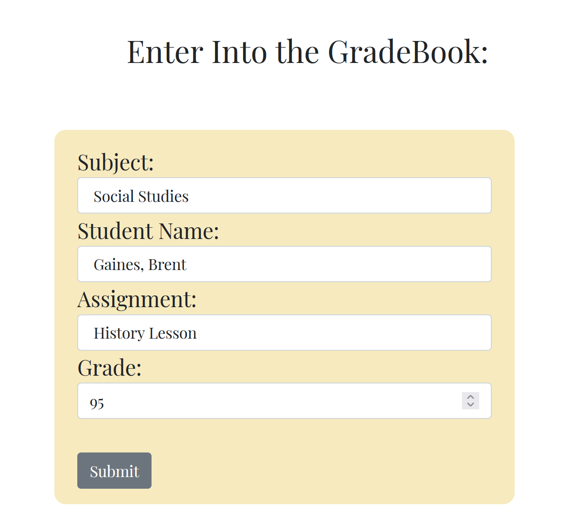

# HOMEROOM

  [](https://badges.pufler.dev)

    <br>

   


<br>


## TABLE OF CONTENTS
  1. [Description](#description)
  2. [Installation](#installation)
  3. [Usage](#usage)
  4. [Technologies](#technologies)
  5. [Contribution](#contribution)
  6. [Testing](#testing)
  7. [License](#licensing)
  8. [About](#about)

## Description

A teacher portal application in which teachers can create accounts and manage their classroom through adding and viewing student rosters, lesson plans, and grade books, with final grades for students being calculated automatically from the list of assignments related to each subject. 

### This project can be found:

- [GitHub Respository](https://github.com/michellewehr/homeroom)
- [Live Deployment](https://homeroomportal.herokuapp.com/)

---

## Installation

If you just wish to use the application for your classroom, simply go to the live deployment above and create an account. Details on the app's functionality are below.

**IF YOU ARE A DEVELOPER INTERESTED IN COLLABORATING:**

You must have [Node.js](https://nodejs.org/en/) installed.

Go to the [repository](https://github.com/brentocracy/team-profile-generator) and clone it by entering ``` git clone https://github.com/michellewehr/homeroom.git```. You may also fork the repo.

Run `npm install` to include all dependencies. The dependencies include:

#### *Handlebars*
[Handlebars](https://github.com/handlebars-lang/handlebars.js) was used to render the front-end pages.
#### *Argon2*
[Argon2](https://github.com/ranisalt/node-argon2) was used for secure password hashing. The code blocks for this purpose are in two places.

When a user submits a sign-up form, `argon2` collects the password and hashes it immediately for protection, directly linking the user input to the new hash:

```c
    let userPassword = req.body.password;
    let hashedPassword = await argon2.hash(userPassword, {
    type: argon2.argon2id,
    hashLength: 50
  });
```

Then, upon login, `argon2` verifies the user's password input. This is an instance method on the `Teacher` data model:

```c
    async checkPassword(loginPassword) {
      return await argon2.verify(this.password, loginPassword);
   };
```
#### *Cookie Parser*
[Cookie Parser](https://github.com/expressjs/cookie-parser) for, well, parsing those cookies! It is setup with the entry `server.js`:

```c
app.use(cookieParser())
const sess = {
  secret: process.env.SECRET_WORD,
  cookie: {},
  resave: false,
  saveUninitialized: true,
  store: new SequelizeStore({
    db: sequelize
  })
};

app.use(session(sess));
```
#### *Sequelize*
[Sequelize](https://github.com/sequelize/sequelize) as the ORM tool used to build and manage the MySQL database.
#### *connect-session-sequelize*
[connect-session-sequelize](https://github.com/mweibel/connect-session-sequelize) for session store compatibility with Sequelize.

It's utility is imported into the server:
```c
const SequelizeStore = require('connect-session-sequelize')(session.Store);
```
#### *Express* and *Express Session*
[Express](https://github.com/expressjs/express) and [Express-Session](https://github.com/expressjs/session) for the server framework and its middleware.

#### *dotenv* 
[dotenv](https://github.com/motdotla/dotenv) for environmental variable protection.

#### *Nodemon*
[Nodemon](https://github.com/remy/nodemon) is a **development dependency** which allows you to automatically restart the server upon any saved changes. You can run nodemon with the command `npm run watch`.
#### *Jest*
[Jest](https://github.com/facebook/jest) is available to run tests for any utility functions (there are currently two in the application). Jest has already been configured to run robust outputs (coverage) with the command `npm test`.

---

## Usage

This is an intuitive and easy-to-use application. Users create an account (or login if already signed up) via the landing page, and then taken to the application dashboard, in which a card representing each section of the application is ready to click through: Class Roster, Lesson Plans, and Grades. The specifics of the application are gone into below.

### General

The building of Homeroom was done with a traditional MVC (Model-View-Controller) format. The database was built through Models initially, and then the server (Controller) was built to interact with the data, manage it, and send the request to the Views to be rendered to the page for the user.

The user can do a bunch of cool things with Homeroom. Let's go through them.

#### Signing In

Of course, you'll need to create an account to begin using this. You will sign in and log in with your email address, and a password which is validated via a regular expression to be a typical strong password -- one uppercase character, one lowercase, one number, one symbol, and a length of at least 8 characters.


*Fig. 1: The sign-up form in all its glory!*

#### The Dashboard


*Fig 2: The cards even give a little shake when you hover over them. How inviting...*

As mentioned above, the dashboard is where you will be making decisions on what you want to do through cards representing each area of the application:

-- ***Class Roster***


*Fig 3: Each student you add will be generated to the class roster table.*

The class roster is where you can add a student to your class, complete with their guardian and his or her contact email. Once a student is added, Homeroom fills your database and allows you to select a student from a drop-down menu when you add your grades.

-- ***Lesson Plans***


*Fig 4: Add, view, filter by subject, or view individually.*

This is where you can add your lesson plans for the day. All fields are required to add a lesson plan, including the date and the subject and the name of the lesson. Once you have added a plan, your plans will be automatically sorted by date (earliest first), and you can view each lesson plan individually by clicking on its title in the table.

You may also filter your lessons by subject through the drop-down menu on the left. This is an important organization tool, and the lesson plan data model links the students and their grades through the grade books.

-- ***GradeBooks***




*Figs 5 and 6: Each subject has a card for viewing the grades and adding grades for assignments linked to that subject.*

The gradebooks are rather dynamic. When you choose to add a grade, the subject you've chosen will already be selected on the grade form and you'll have your selection of students in your class roster to grade. You will also have a selection of all assignments associated with the particular subject, and then you can add your grade. 

A table showing each student and his or her grade in each assignment per subject will be most valuable to teachers. Grades can be empty if an assignment is created which has not yet been graded. 


*Fig 7: Final grades are the average of every assignment grade for each student. Eat dust, Fred Astaire!*

Considering this is the initial release, Homeroom will continue to add features and enhancements.

---

## Technologies

> The following were used for this project:

- `HTML`
- `CSS`
- `Bootstrap`
- `Animate.CSS`
- `Handlebars`
- `JavaScript`
- `Node`
- `Express`
- `Sequelize`
- `Git`
- Coded in `VS Code`

---

## Contribution

We welcome contributions from other fine developers.

If you would like to contribute to this project:

Navigate to your workspace in your terminal and clone the repository code there using `git clone`. Make sure to create your own branch with `git checkout -b branch-name` and open up a pull request to push changes. 

---

## Testing

As mentioned, the command `npm test` will run `Jest` with its `--coverage` report.

To add tests, you can either create a new script for a utility function in the `/utils` directory or add a function to the `helpers.js` script already in place. A standard `Jest` test looks something like this (one of the tests already written for the app):

```c
   test('Name is formatted with first letter capitalized and trimmed white space', () => {
    const name = "  jOHn";
    expect(format_name(name)).toEqual('John');
});
```

The name of the test followed by a function which instantiates a mock of whichever object/array/function/variable is being tested, followed by what should be the expected result of the test. Remember to name your test file the same as your script file (if new) with a .test in between. The example: `helpers.js` is the script with utility functions to be tested, and `helpers.test.js` is the script in the `/_test_` directory to test those functions.


## Licensing

This application is operating under the `MIT` license.

## About

This application was a happy collaboration between:

# *Brent Gaines:*


I am a Full-Stack Web Developer committed to building fun and efficient projects!

Kindly reach out at <brentmatthewgaines@gmail.com>!

Connect with me:

<a href="https://twitter.com/brentocracy" target="blank"></a>
<a href="https://linkedin.com/in/brent-gaines" target="blank"></a>
</p>

### [GITHUB PROFILE](https://github.com/brentocracy)

# *Michelle Wehr:*


### [GITHUB PROFILE](https://github.com/michellewehr)

# *Maki A Maki:*

I'm Maki (pronounced Mekki) from CT USA, and I am a Full-Stack Web Developer. I am passionate about helping create solutions to big problems and collaborating with a team of passionate programmers.

### [GITHUB PROFILE](https://github.com/Makispear)
